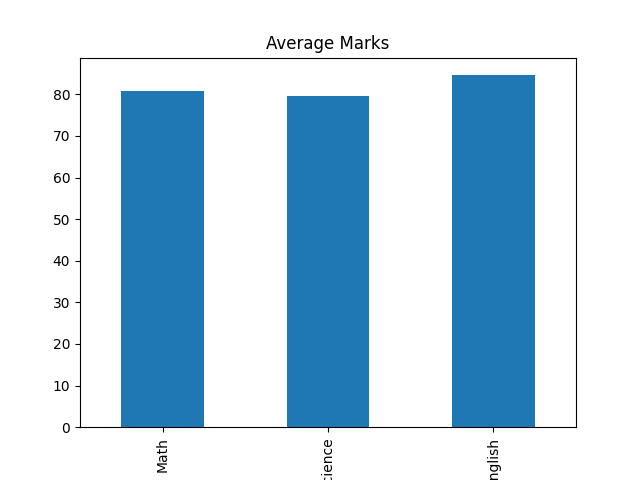
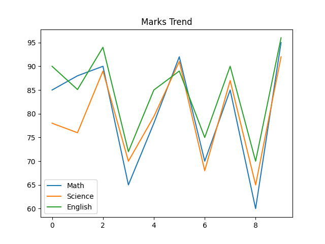
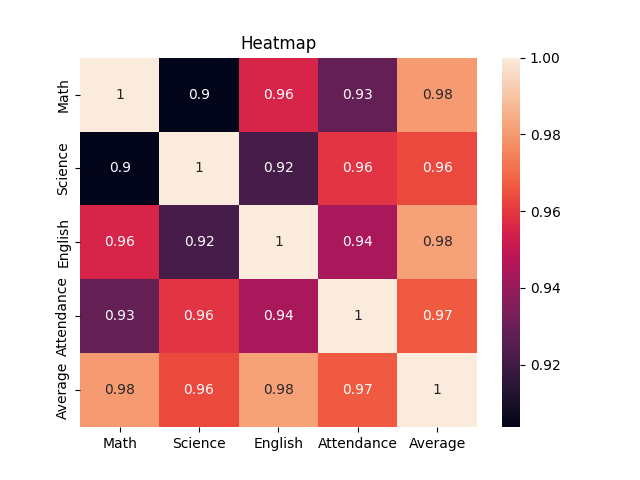

# 📊 Data Cleaning & Visualization Project

## 👨‍💻 Author
ASWATH SHRI RAM S.B

---

## 📌 Overview
This project cleans student data and analyzes it using graphs and a dashboard.

---

## 🎯 Objective
- Clean data  
- Handle missing values  
- Create graphs  
- Build dashboard  

---

## 🛠 Tools Used
- Python  
- Pandas  
- Matplotlib  
- Seaborn  
- Streamlit  

---

## 📈 Visualizations

### Bar Chart

### Line Chart

### Heatmap

---

## 📊 Dashboard
This project includes a Streamlit dashboard (app.py).

---

## 🚀 How to Run

pip install pandas matplotlib seaborn streamlit  
python main.py  
streamlit run app.py  

---

## 📄 Report
[Download Report](Report.pdf)

---

## ✅ Conclusion
This project shows how data cleaning and visualization help understand data.
